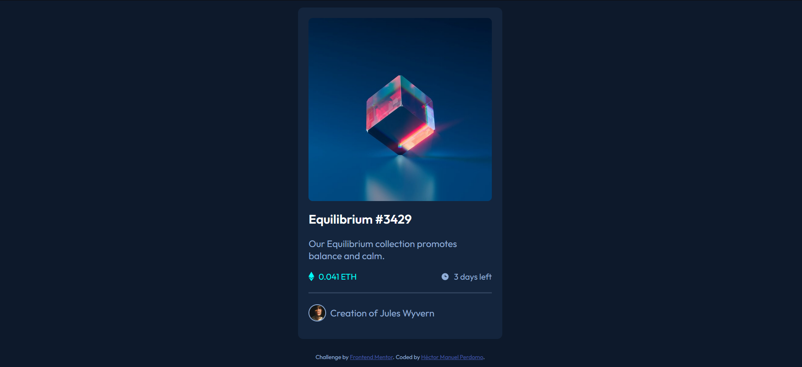

# Frontend Mentor - NFT preview card component

## Welcome! 👋

This is my solution to the [NFT preview card component coding challenge](https://www.frontendmentor.io/challenges/nft-preview-card-component-SbdUL_w0U)

You can view a live preview of my solution [here](https://upbeat-mahavira-49eff3.netlify.app/).

## Table of contents

- [Frontend Mentor - NFT preview card component](#frontend-mentor---nft-preview-card-component)
  - [Welcome! 👋](#welcome-)
  - [Table of contents](#table-of-contents)
  - [Overview](#overview)
    - [The challenge](#the-challenge)
    - [Screenshot](#screenshot)
    - [Links](#links)
  - [Author](#author)

**Note: Delete this note and update the table of contents based on what sections you keep.**

## Overview

### The challenge

Users should be able to:

- View the optimal layout depending on their device's screen size
- See hover states for interactive elements

### Screenshot

### Links

- Solution URL: [Add solution URL here](https://your-solution-url.com)
- Live Site URL: [Add live site URL here](https://upbeat-mahavira-49eff3.netlify.app/)

## Author

- Frontend Mentor - [@sisifodev](https://www.frontendmentor.io/profile/SisifoDev)

